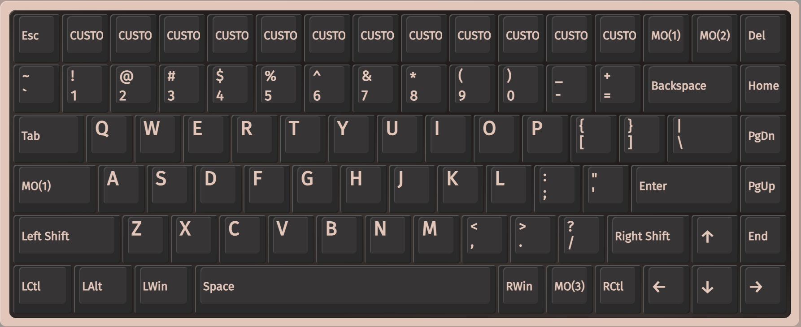

# FnCoder84 — QMK update & VIA (session notes)

This document records bringing the custom FnCoder boards up to current QMK, enabling VIA, and related fixes.



*VIA Configure view after loading `via.json` (correct 16-wide top row and nav column).*

---

## Context

The `alexfry/qmk_firmware` fork was far behind upstream QMK (merge-base ~April 2024, ~**2,500 commits** / version ~0.24 → **0.33.x**). Custom work is almost entirely under `keyboards/` for the **FnCoder** family.

**Active boards (this work):**

| Board | Role | MCU | Encoders | USB |
|-------|------|-----|----------|-----|
| **fncoder84** | 84% / 75%-style + nav | `at90usb1286` | 12 | `AF84:0084` |
| **fncoder24** | Number pad | `atmega32u4` | 4 | `AF84:0024` |

Both share: VIA + `encoder_map`, boot LED chase + warm white settle, Raw HID LEDs (`0xFE`) / control (`0xFC`) / encoder events (`0xFD`), MIDI dual-emit. Board-specific notes: [fncoder24/HOST_RAW_HID_PROTOCOL.md](../../fncoder24/HOST_RAW_HID_PROTOCOL.md).

Other trees (`FnCoder24_021`, `FnCoder24_ProMicro`, `FnCoder84 024`, `FnCoder84_ledTest`, `fncoder77`) were **left in place** and not modernized.

Folder names were normalized to **lowercase** (`fncoder84`, `fncoder24`) because current QMK requires keyboard paths matching `^[0-9a-z][0-9a-z_/]*$`.

---

## 1. Sync with upstream QMK

- Remote `upstream` → `https://github.com/qmk/qmk_firmware`
- Branch: `update-to-upstream` (merge of `upstream/master`)
- Local-only core change dropped: `QK_JOYSTICK_BUTTON_32` in `quantum/keycodes.h` (unused; fork noise)
- Submodules updated after merge

Git conflict surface was tiny (additive keyboards + one core line). The real work was modernizing board config for post–data-driven QMK.

---

## 2. Board modernization

### Data-driven config

Replaced legacy `info.json` + bloated `config.h` / `rules.mk` with:

- **`keyboard.json`** — MCU, bootloader, matrix, encoders, RGB, backlight, features, USB, layouts
- Minimal **`config.h`** — e.g. `MIDI_ADVANCED` only where needed
- Slim **`rules.mk`**

### Notable API / feature updates

| Area | Change |
|------|--------|
| Boot | `RESET` → `QK_BOOT` |
| RGBLight keycodes | `RGB_*` → `UG_*` (e.g. `UG_TOGG`, `UG_HUEU`) |
| Backlight keycodes | `BL_INC` / `BL_DEC` → `BL_UP` / `BL_DOWN` |
| Backlight driver | **`timer`** (pins C7 / D0 are not hardware-PWM-capable on these AVRs) |
| Layout macro | `KEYMAP` → data-driven `LAYOUT` via `keyboard.json` |
| JSON | Valid JSON only (no `//` comments in config) |

### Encoders: “everything is volume”

On current QMK, the default `encoder_update_kb` still injects **volume** when `encoder_update_user` returns **`true`**:

```c
// quantum/encoder.c (simplified)
bool res = encoder_update_user(index, clockwise);
if (res) {
    tap_code(KC_VOLU); // or VOLD
}
```

**Fix:** after handling MIDI / layer logic, **`return false`** so the default volume path does not run.

Applied on both **fncoder84** and **fncoder24**.

### Base keymap (fncoder84)

- Layer 0: QWERTY + encoder MIDI CC (relative on base; layer-specific turns — see VIA encoder table)
- Custom `MI_CHn_Click` keycodes for MIDI CC gate-style presses (encoder push)
- `MO(3)+R` → bootloader (`QK_BOOT`)
- `MO(3)` + encoder **turn** → that encoder’s status LED hue (per-LED, not global RGB)
- Nav cluster key order: **Home → PgUp → PgDn** (PgUp between Home and PgDown)

### Boot LED animation & default colour

Restored from pre-refactor firmware (`506c716`):

1. Enable RGB; start dark
2. Chase: each of the 12 encoder LEDs flashes warm-orange (`HSV 17/180/255`) for 50 ms, then off
3. Settle: warm white **HSV 27 / 110 / 100** (not full-bright cool white)

Defaults also live in `keyboard.json` → `rgblight.default` (`hue` 27, `sat` 110, `val` 100). Applied in `keyboard_post_init_user` with `*_noeeprom` so stale VIA/EEPROM lighting cannot stick at boot.

---

## 3. USB IDs (required for VIA)

Modern VIA **rejects** vendor ID **`0xFEED`** (QMK placeholder).

| Board | VID | PID |
|-------|-----|-----|
| fncoder84 | **`0xAF84`** | **`0x0084`** |
| fncoder24 | **`0xAF84`** | **`0x0024`** |

Update any desktop tools that still open `FEED:F084` / `FEED:F024`.

---

## 4. VIA support

### Firmware

- Keymap: `keyboards/fncoder84/keymaps/via/` (`VIA_ENABLE = yes`, includes default keymap)
- `ENCODER_MAP_ENABLE = yes` — required for VIA to read/write rotary CCW/CW keycodes
- `dynamic_keymap.layer_count`: **5** (matches default layers)
- Build: `qmk compile -kb fncoder84 -km via`

### Definition file

Load in VIA **Design** tab (V2 definitions **OFF**):

```text
keyboards/fncoder84/via.json
```

**Do not** enable “Use V2 definitions” — V2 expects a `lighting` field and rejects V3 `menus` / `keycodes`.

### Encoders in VIA (all 12)

The top-row encoder positions are tagged as VIA rotaries **`e0`–`e11`** (matrix click `0,0`–`0,11` + rotation). In VIA you should see each as a **knob**: assign **CCW** and **CW** keycodes per layer.

| Firmware path | How rotation works |
|---------------|--------------------|
| **`via`** | `encoder_map` (VIA-remappable). See defaults below. |
| **`default`** | Legacy `encoder_update_user` (same behaviours, not VIA-remappable) |

#### Default encoder map (`via` keymap)

| Layer | Hold / when active | Turn behaviour |
|-------|--------------------|----------------|
| **Base** | — | Relative **MIDI CC** channel 1, controllers **1–12**, values **63** (CW) / **65** (CCW) |
| **FN1** | MO(1) | Same relative MIDI CC |
| **FN2** | MO(2) | Scroll / arrows / letter keys / backlight / volume (legacy pairs) |
| **FN3** | **MO(3)** | **Per-encoder status LED hue** — only that knob’s LED cycles hue (sat/val 255), step of 4 |
| **FN4** | MO(4) | Transparent (`KC_TRNS`) |

Encoder **push** (matrix) is separate: base layer `MI_CH1`…`MI_CH12` still send MIDI CC click (127/0).

#### EEPROM note (encoder turns empty after first VIA flash)

Matrix keymaps live in VIA EEPROM from the first VIA connect. **`encoder_map` only appears in EEPROM after a reset/seed.** If the board already had valid VIA data *before* `ENCODER_MAP_ENABLE`, rotation slots can stay `KC_NO` (clicks work, turns do nothing).

Firmware seeds the full encoder map from flash defaults once per **encoder-map version** (user EEPROM magic `0xA84E` + version byte). Bump `FNCODER_ENCODER_MAP_VER` in `keymap.c` when defaults change so boards re-seed on next boot. Full VIA “reset keymap” / clear EEPROM also reloads defaults.

After changing `via.json`, **reload the draft definition** in Design, then re-check Configure. A firmware reflash is required for `ENCODER_MAP_ENABLE` / new defaults.

### Correct VIA geometry (what the screenshot shows)

Top row is **16** keys, matching the hardware:

**Esc + 12 encoder knobs (e0–e11) + MO(1) + MO(2) + Del**

| Row | Right edge (nav column) |
|-----|-------------------------|
| Top | **Del** |
| Numbers | **Home** (after 2u Backspace) |
| QWERTY | **PgUp** (after `\`) |
| Home / Enter | **PgDn** (after Enter) |
| Shift | **Up** · **End** |
| Bottom | **← ↓ →** |

All rows are **16u** wide (KBD75-style). Earlier broken drafts either used a 15-key top row (empty plate on the right) or put two page keys after Enter (17u row + orphan key / empty strip).


### VIA + host LED control (coexist)

VIA owns Raw HID for its protocol. Host status LEDs use a **non-colliding** command byte:

| | |
|--|--|
| Prefix | **`0xFE`** (`FNCODER_HOST_CMD`) |
| Handler | `via_command_kb()` when `VIA_ENABLE`; `raw_hid_receive()` on default |

VIA command IDs include `0x01` and `0x04`, which were the old unprefixed LED opcodes — those must not be used on VIA builds without the `0xFE` prefix.

Full packet docs: [../HOST_RAW_HID_PROTOCOL.md](../HOST_RAW_HID_PROTOCOL.md) (LEDs `0xFE`, control `0xFC`, encoder events `0xFD`). LED-only subset: [../HOST_LED_PROTOCOL.md](../HOST_LED_PROTOCOL.md).

VIA’s built-in RGBLight / backlight menus still work (`menus`: `qmk_backlight_rgblight`). Last writer wins on the same LEDs if the desktop app and VIA both drive RGB.

### Encoder events over Raw HID (PCoIP)

When USB MIDI is not forwarded correctly (e.g. some PCoIP setups), the keyboard dual-emits **relative** encoder turns and button edges as unsolicited Raw HID **IN** reports (`0xFD`). Host apps read that stream and still send status LEDs with `0xFE`. See the protocol doc and `tools/raw_hid_encoder_monitor.py`.

---

## 5. Flashing notes (macOS)

| Issue | Workaround |
|-------|------------|
| Toolbox: “Please select a microcontroller” with **AT90USB1286** selected | Toolbox treats list index `0` as “nothing selected”; **AT90USB1286 is first in the list**. Use **dfu-programmer** / `qmk flash`. |
| DFU ID | `03EB:2FFB` (AT90USB128 family) |
| Quit Toolbox before CLI flash | Avoids USB device held open |

```bash
export PATH="$HOME/Library/Python/3.9/bin:/opt/homebrew/opt/avr-gcc@14/bin:/opt/homebrew/bin:$PATH"
dfu-programmer at90usb1286 erase --force
dfu-programmer at90usb1286 flash .build/fncoder84_via.hex
dfu-programmer at90usb1286 reset
```

If VIA shows old key labels after a keymap change, clear EEPROM or reset the keymap in VIA (dynamic keymap lives in EEPROM).

---

## 6. FnCoder24 (parallel work)

- Path: `keyboards/fncoder24/`
- Same modernization pattern; **LTO** enabled (VIA build was tight on 32u4 flash)
- Encoders: MIDI CC, `return false` for volume fix
- USB: `0xAF84` / `0x0024`
- VIA skeleton: `keymaps/via/`, `via.json` (less iterated than 84)

```bash
qmk compile -kb fncoder24 -km default   # or via
```

MCU: **ATmega32U4** / DFU `03EB:2FF4` (not the same DFU device as 84).

---

## 7. File map (fncoder84)

```text
keyboards/fncoder84/
  keyboard.json          # data-driven hardware + LAYOUT
  config.h               # MIDI_ADVANCED, etc.
  rules.mk
  fncoder84.c / .h
  via.json               # VIA V3 draft definition
  HOST_LED_PROTOCOL.md   # desktop LED Raw HID
  README.md
  docs/
    UPDATE-AND-VIA.md    # this file
    via-layout.png       # Configure screenshot
    board-photo.png      # hardware reference
  keymaps/
    default/keymap.c     # main logic (encoders, MIDI, LEDs)
    via/                 # VIA_ENABLE + include default
```

---

## 8. Checklist for a clean machine

1. QMK CLI + AVR toolchain (`avr-gcc`, `dfu-programmer`)
2. `qmk config user.qmk_home=…` to this repo
3. `git submodule update --init --recursive` if needed
4. Compile/flash `fncoder84:via` (or `default`)
5. VIA web app → Design → load `via.json` (V2 off) → Configure → authorize **AF84:0084**
6. Desktop LED app: VID/PID **AF84/0084**, packets prefixed with **`0xFE`**

---

## Summary

| Goal | Result |
|------|--------|
| Up to date with QMK | Merged upstream ~0.33.x |
| FnCoder84 builds | `default` + `via` |
| Encoders | MIDI as designed; no forced macOS volume |
| VIA | Working with unique VID/PID + corrected 16-key top row layout |
| Host LED status | Works with and without VIA via `0xFE` |
| Docs | This file + host protocol + board README |
