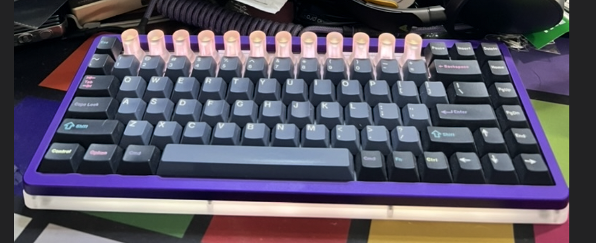

# FnCoder84

Custom **84% / 75%-style** keyboard with **12 encoders**, RGB underglow, backlight, MIDI, and Raw HID host LED control.



* Keyboard Maintainer: [Alex Fry](https://github.com/alexfry/)
* Hardware: FnCoder84 (AT90USB1286, Atmel DFU)
* More: https://alexfry.com/fncoder

## Quick build / flash

```bash
# default keymap (no VIA)
qmk compile -kb fncoder84 -km default
qmk flash   -kb fncoder84 -km default

# VIA keymap
qmk compile -kb fncoder84 -km via
qmk flash   -kb fncoder84 -km via
```

**Bootloader:** hold **MO(3)** (bottom row, right of RGUI) and tap **R**, or use the hardware reset.

**MCU for Toolbox / dfu-programmer:** `at90usb1286`  
**Note:** QMK Toolbox on macOS may reject MCU index 0 (`AT90USB1286`); use CLI if needed:

```bash
dfu-programmer at90usb1286 erase --force
dfu-programmer at90usb1286 flash .build/fncoder84_via.hex
dfu-programmer at90usb1286 reset
```

## Encoders (summary)

| Action | Behaviour (default / via defaults) |
|--------|-------------------------------------|
| **Push** encoder | MIDI CC click (CC 1–12) |
| **Turn** (base) | Relative MIDI CC (values 63/65) |
| **Turn** while holding **MO(3)** | That encoder’s status LED hue |
| VIA | All 12 knobs as `e0`–`e11` (CCW/CW remappable per layer) |

Definition: `via.json` · details: [docs/UPDATE-AND-VIA.md](docs/UPDATE-AND-VIA.md)

### Raw HID events (PCoIP-friendly)

Relative turns and pushes also go out as Raw HID IN reports (`0xFD`) so a host app can control software when USB MIDI forwarding fails (e.g. some PCoIP setups). LEDs stay on `0xFE`. See [HOST_RAW_HID_PROTOCOL.md](HOST_RAW_HID_PROTOCOL.md).

```bash
python3 -m pip uninstall -y hid hidapi && python3 -m pip install --user hidapi
python3 keyboards/fncoder84/tools/raw_hid_encoder_monitor.py
```

## Boot LEDs

Orange chase across the 12 encoder LEDs, then settle at warm white **HSV 27/110/100**.

## Documentation

| Doc | Topic |
|-----|--------|
| [docs/UPDATE-AND-VIA.md](docs/UPDATE-AND-VIA.md) | Full write-up: QMK update, VIA, encoder map, EEPROM seed, flashing |
| [HOST_RAW_HID_PROTOCOL.md](HOST_RAW_HID_PROTOCOL.md) | Bidirectional Raw HID: LEDs (`0xFE`), control (`0xFC`), encoder events (`0xFD`) |
| [HOST_LED_PROTOCOL.md](HOST_LED_PROTOCOL.md) | LED-only subset (legacy pointer) |
| [tools/raw_hid_encoder_monitor.py](tools/raw_hid_encoder_monitor.py) | PING + live TURN/BUTTON monitor (hidapi) |

## USB IDs

| | Value |
|--|--------|
| VID | `0xAF84` |
| PID | `0x0084` |

(`0xFEED` is rejected by modern VIA as a placeholder VID.)
